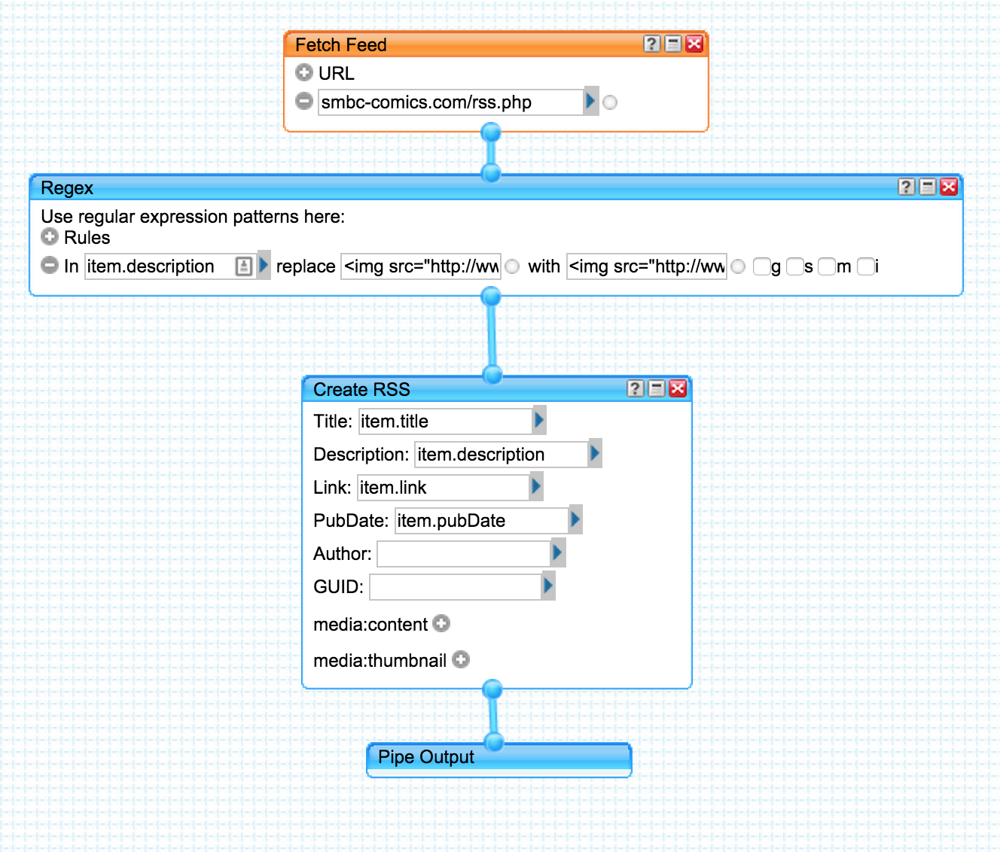

# SMBC RSS Plus Feed

I have a question to ask you:

Do you use a mobile RSS Reader? How many of them have added support for showing the contents of `alt` when you long-press on an image? I'm guessing we have to thank the popularity of XKCD for that!

Unfortunately, the red-button bonus image situation with SMBC is a bit more complicated than that. It is *usually* at some URL that is derived from the original image. Also, SMBC is probably not as popular as XKCD to get special functionality developed for it.

To address this, somebody (**TODO**) created a Yahoo Pipe. I've since forked it to address issues with the new "post-png" button images. Alas, Yahoo Pipes is shutting down. As such, this whole operation is going to need a new implementation. This is it.

## Rough New Architecture

It's just a Docker container that has a Python script that grabs the existing RSS feed, modifies it, and updates the served RSS file on some S3 container. KISS. Should cost me less than a few cents a month.

## RIP Yahoo Pipes

This was originally based on this Yahoo Pipe. I can't link it because Yahoo Pipes is going to be dead but I can provide this screenshot of the pipe and the two cut-off text-fields.

This was the whole pipe:

Screenshot:

* Replace: `(.*)`
* With: `  $3`

That was the whole thing!

**TODO** Find the first mention on Reddit and give credit.
